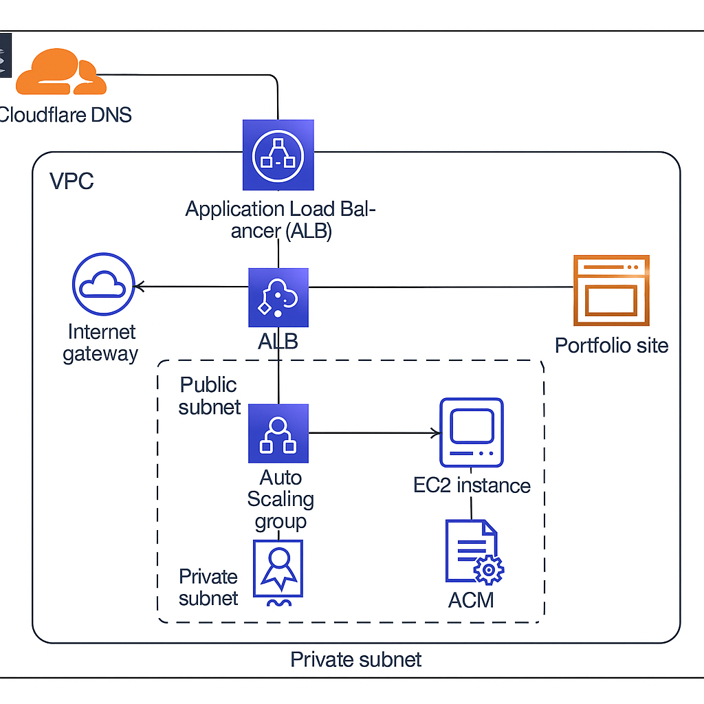

# Terraform AWS Portfolio Infrastructure

This project showcases a production-grade AWS infrastructure built entirely with Terraform. It powers my personal portfolio site [shivdevops.cloud](https://shivdevops.cloud), and demonstrates modular infrastructure design, automation, and cloud-native best practices.

---

## 📐 Architecture Overview



The infrastructure includes:

- VPC with public/private subnets
- NAT Gateway and Internet Gateway
- Application Load Balancer (ALB)
- Auto Scaling Group (ASG) with Launch Template
- EC2 instances (public and private)
- Security Groups and Route Tables
- ACM for SSL termination
- Cloudflare DNS integration

---

## 🎯 Use Cases

This infrastructure is ideal for:

Personal or business portfolio hosting
Startup MVP deployments
Scalable web applications
Client projects requiring modular Terraform
Secure multi-tier architectures
Cloud migration and modernization projects


## ✨ Features

- Fully modular Terraform design
- Production-grade VPC with public & private subnets
- Highly available ALB + ASG setup
- Launch Template with user-data automation
- Public & private EC2 instances
- NAT Gateway for secure outbound traffic
- ACM SSL termination for HTTPS
- Cloudflare DNS integration
- Reusable modules for real-world client projects


## 📸 Screenshots

| Component        | Screenshot                          |
|------------------|-------------------------------------|
| VPC              | `docs/screenshots/VPC.png`          |
| Subnets          | `docs/screenshots/SUBNETS.png`      |
| NAT Gateway      | `docs/screenshots/NAT-GW.png`       |
| ALB              | `docs/screenshots/ALB.png`          |
| Target Group     | `docs/screenshots/Target_group.png` |
| ASG              | `docs/screenshots/ASG.png`          |
| Launch Template  | `docs/screenshots/Launch-Template.png` |
| EC2 Instance     | `docs/screenshots/Instance.png`     |
| ACM              | `docs/screenshots/Certificates.png` |
| Cloudflare DNS   | `docs/screenshots/Cloud_flare.png`  |

---

## 🚀 Live Demo

Visit: [shivdevops.cloud](https://shivdevops.cloud)

---

## 🛠️ Tech Stack

- Terraform (modular)
- AWS (EC2, ALB, ASG, VPC, ACM)
- Cloudflare DNS
- GitHub for version control

---

## 🔐 Security Best Practices

- Least privilege IAM roles
- Private subnets for backend workloads
- Security groups with restricted inbound rules
- HTTPS termination using ACM
- NAT Gateway for secure outbound traffic
- No hardcoded secrets in Terraform
- Modular design for auditability

---

## 🧩 Module Overview

| Module | Description |
|--------|-------------|
| vpc | Creates VPC, subnets, route tables, IGW, NAT |
| alb | Application Load Balancer + listeners + target groups |
| asg | Auto Scaling Group with scaling policies |
| launch-template | EC2 launch template with user-data |
| ec2-public | Public EC2 instance for testing/demo |
| ec2-private | Private EC2 instance behind ALB |


## 📂 Repo Structure

```
terraform-aws-portfolio-infrastructure/
├── terraform/
│   ├── main.tf
│   ├── variables.tf
│   ├── output.tf
│   ├── backend.tf
│   ├── terraform.tfvars.example
│   ├── README.md
│   └── modules/
│       ├── vpc/
│       ├── alb/
│       ├── asg/
│       ├── launch-template/
│       ├── ec2-public/
│       └── ec2-private/
├── docs/
│   ├── Architecture_diagram.png
│   └── screenshots/
└── README.md
```

---

## 🚀 Getting Started

### Prerequisites
- Terraform >= 1.0
- AWS Account with appropriate IAM permissions
- AWS CLI configured

### Setup

1. Clone the repository:
```bash
git clone <repo-url>
cd terraform-aws-portfolio-infrastructure
```

2. Navigate to the terraform directory:
```bash
cd terraform
```

3. Create `terraform.tfvars` from the example:
```bash
cp terraform.tfvars.example terraform.tfvars
```

4. Update the variables with your AWS region and project details.

5. Initialize and deploy:
```bash
terraform init
terraform plan
terraform apply
```

---

## 💡 Why This Project Matters

This project demonstrates my ability to design, build, and document a complete production-ready AWS environment using Terraform.  
It reflects real-world client work, including modular IaC, scalability, security, and cloud-native best practices.
The infrastructure is fully reproducible, cost‑optimized, and designed for high availability — exactly what modern businesses expect.


## 💼 About Me

I'm a Cloud & DevOps Architect specializing in multi-cloud infrastructure, automation, and client-ready solutions. This repo is part of my freelance portfolio to showcase real-world deployments and reproducible infrastructure.

---

## 🔮 Future Enhancements

- Add RDS module for database layer
- Add EKS module for Kubernetes workloads
- Add GitHub Actions CI/CD pipeline for Terraform
- Add S3 + CloudFront static hosting module
- Add cost-optimization recommendations
- Add monitoring with CloudWatch dashboards

---

## 💰 Cost Optimization Notes
NAT Gateway placed in a single AZ to reduce cost
ASG scales down to minimum during low traffic
Reusable modules reduce maintenance overhead
Infrastructure can be adapted to use Spot Instances
Cloudflare caching reduces ALB traffic

---

## 🤝 Contributing
Contributions, improvements, and suggestions are welcome.
Feel free to open an issue or submit a pull request.

---

## 📄 License
This project is licensed under the MIT License.

---

## 📬 Contact
If you'd like help building similar infrastructure or want to collaborate, feel free to reach out.